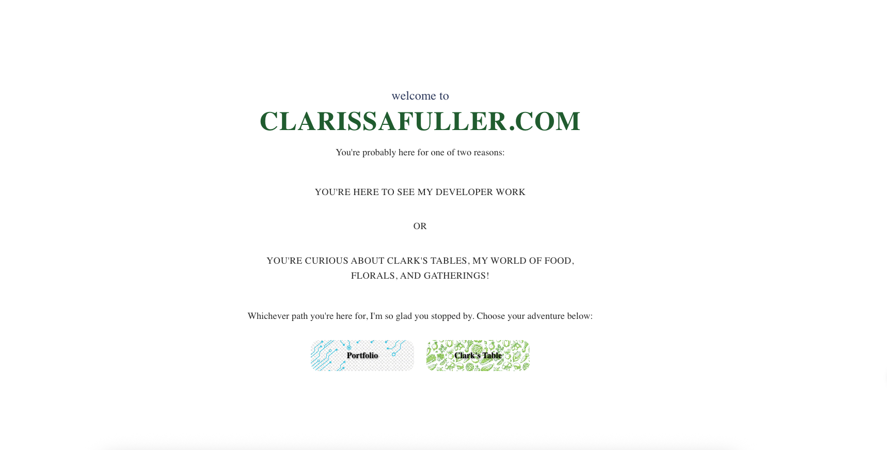
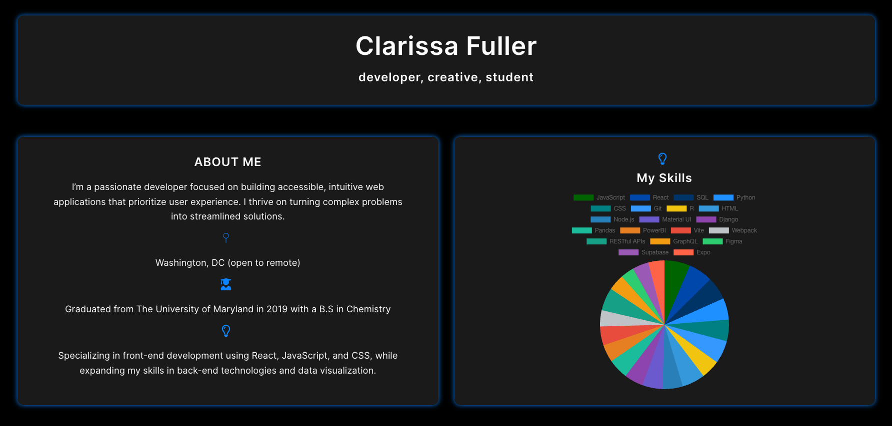

DynamicPage

# DynamicPage


**DynamicPage** is a sleek, responsive portfolio website built with React, Vite, and CSS.  
After redesigning my portfolio multiple times, I created DynamicPage as a scalable and adaptable solution — built to evolve alongside my skills and career.

👉 **Live Demo:** [https://clarissafuller.com](https://clarissafuller.com)

---

## ✨ Features

- ⚡ Fast performance with Vite
- 🎨 Clean black, gray, and blue "tech" aesthetic
- 📱 Fully responsive design
- 🧩 Modular React components
- 📊 Dynamic skills and experience sections
- 💡 Designed to be easily updated as I grow

---

## 🛠️ Built With

- **React**
- **JavaScript**
- **CSS3**
- **Vite**
- **GitHub Pages**

---

## 🚀 Getting Started

1. **Clone the repository:**
   ```bash
   git clone https://github.com/clarissafuller/DynamicPage.git
   ```
2. **Install Dependancies:**
   ```bash
   npm install
   ```
3. **Install Dependancies:**
   ```bash
   npm run dev
   ```

## 📸 Screenshots

|                                   Homepage                                   |                               Portfolio Section                               |                               Clark's Tables Section                               |
| :--------------------------------------------------------------------------: | :---------------------------------------------------------------------------: | :--------------------------------------------------------------------------------: |
|  |  |  |

---

## 🌟 Future Improvements

- Add dark/light mode toggle
- Add live Github commits count
- Add more project information from repos
- Optimize for Lighthouse performance scores
- Accessibility improvements (ARIA labels, color contrast)

---

## 🧑‍💻 Author

**Built by Clarissa Fuller**  
© 2025 Clarissa Fuller — All rights reserved.

- [Portfolio](https://clarissafuller.com)
- [LinkedIn](https://www.linkedin.com/in/clarissa-fuller-360096109/)
- [Email](mailto:clarissafuller5@yahoo.com)

---

## 📦 Technologies Used


